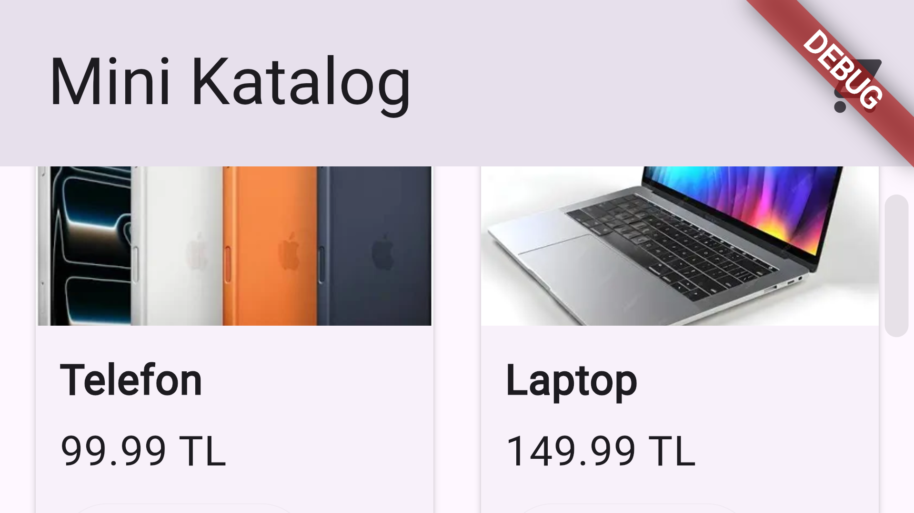
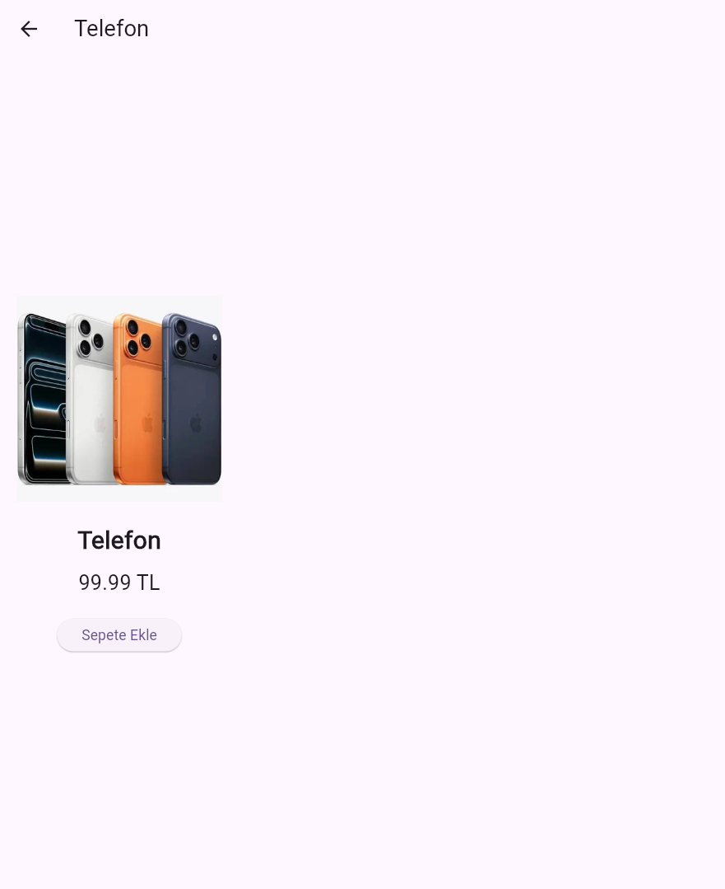
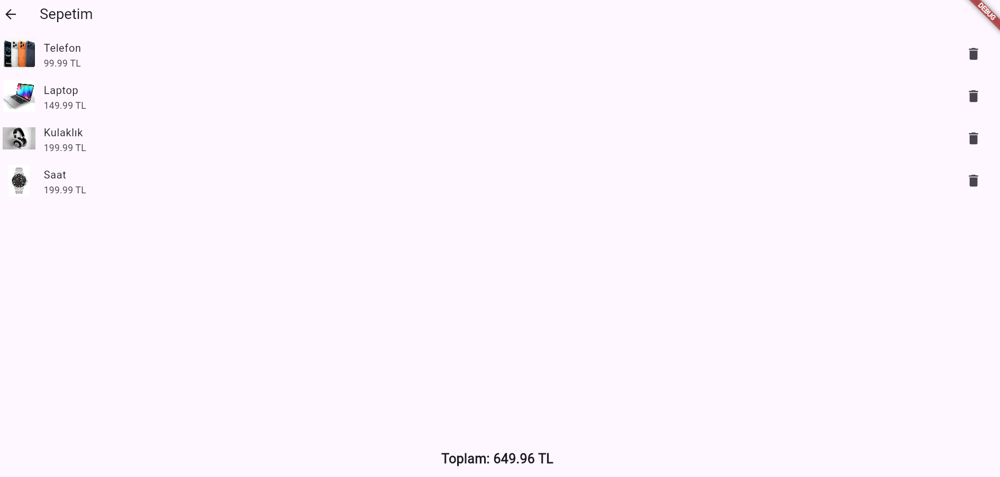

# Mini Katalog Uygulaması

 Proje Tanımı
Bu proje, Flutter günlük eğitim kapsamında geliştirilmiş basit bir katalog uygulamasıdır.  
Amaç: Flutter’ın temel widget yapısını, sayfa geçişlerini, JSON veri okuma mantığını ve basit state yönetimini öğretmek.  

 Kullanılan Araçlar
- Flutter SDK (3.x)
- Dart SDK
- Visual Studio Code
- Android Studio (Emulator)
- Android Emulator veya Fiziksel Android Cihaz

 Kullanılan Paketler
- `material.dart` (varsayılan Flutter paketi)  
 Ekstra paket kullanılmamıştır.

 Uygulama Özellikleri
- Ana sayfa: GridView ile ürün listesi  
- Ürün detayı: Görsel, fiyat, sepete ekleme butonu  
- Sepet ekranı: ListView ile ürünleri gösterme  
- Toplam fiyat hesaplama  
- Sepetten ürün silme özelliği  
- JSON dosyasından dinamik veri yükleme  

 Proje Klasör Yapısı
mini_katalog/
lib/
main.dart
assets/
images/
shopping.png
laptop.png
headphones.png
watch.png
data/
products.json
pubspec.yaml


 Çalıştırma Adımları
1. Flutter SDK’yı kurun.  
2. Projeyi klonlayın:  
   ```bash
   git clone <repo-url>
   cd mini_katalog
3. Paketi Yükleyin
   flutter pub get
4. Uygulamayı çalıştırın
   flutter run


Ekran Görüntüleri

Ana Sayfa


Ürün Detayı


Sepet


